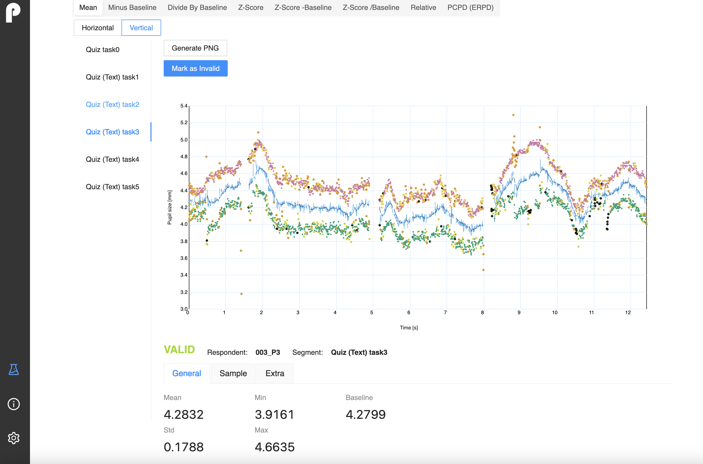

# Pupillometry App

A scientific utility designed for preprocessing, visualizing, and analyzing raw pupillometry data, configured by default for data exported from the iMotions platform.

The app is purpose-built to meet the specific needs of researchers and was created as a graduation project.



## Documentation

Find documentation in both English and Polish in the [/docs](/docs) folder.

Note: Unfortunately, GitHub may corrupt PNG files, causing image-related issues.

## Key Features

- **Preprocessing**: Efficiently prepares raw pupillometry data.
- **Visualization**: Provides visualizations for insightful analysis.
- **Analysis**: Conduct in-depth analysis tailored to researchers' needs.

## Features

### Data Processing:

- Remove artifacts from data.
- Calculate various metrics.

### Visualization:

- Display data graphically.
- Save charts as PNG.

### Data Analysis:

- Breakdown data by task/scene/segment.
- Analyze left and right eye metrics.

### Study Management:

- Create/Delete Studies and Groups.
- Add/Delete Respondents to Groups.

### Export and Configuration:

- Export metrics to Excel files.
- Configure custom settings.

### Advanced Options:

- Test preprocessing on a single respondent.
- Resample and smooth data.
- Calculate baseline.

### Enhanced Metrics:

- Extra metrics (Z-score, Relative, ERPD/PCPD).
- Include a legend in export files.
- Manually mark segment validity.

### Selective Features:

- Eye selection.
- Divide trial by time windows.
- Create task groups when exporting data.
- Filter metrics in group view by selected segments.

## Recommended Config

The recommended configuration provides optimal settings for various aspects of data processing, visualization, and analysis. Customize as needed for your specific use case.

```json
{
  "name": "Recommended",
  "file": {
    "separator": ",",
    "timestamp": "Timestamp",
    "leftPupil": "ET_PupilLeft",
    "rightPupil": "ET_PupilRight",
    "segmentActive": "Scene active"
  },
  "chart": {
    "width": 1200,
    "height": 600,
    "showEyesPlot": false,
    "showMeanPlot": true,
    "showSmoothed": false,
    "showRejected": []
  },
  "measurement": {
    "eye": "both",
    "baseline": {
      "type": "from Start",
      "param": 1000
    },
    "segmentation": "scene",
    "windows": []
  },
  "markers": {
    "outOfRange": {
      "min": 2,
      "max": 9
    },
    "dilatationSpeed": {
      "on": true,
      "thresholdMultiplier": 3,
      "gapMinimumDuration": 50,
      "gapMaximumDuration": 70,
      "backwardGapPadding": 50,
      "forwardGapPadding": 50
    },
    "trendlineDeviation": {
      "on": true,
      "thresholdMultiplier": 1,
      "cutoffFrequency": 4,
      "passes": 1,
      "gapMinimumDuration": 50,
      "gapMaximumDuration": 70,
      "backwardGapPadding": 50,
      "forwardGapPadding": 50
    },
    "temporallyIsolatedSamples": {
      "on": true,
      "sizeMaximum": 50,
      "isolationMinimum": 40
    }
  },
  "validity": {
    "missing": 40,
    "correlation": 0.5,
    "difference": 1
  },
  "resampling": {
    "on": true,
    "rate": 1000,
    "acceptableGap": 250
  },
  "smoothing": {
    "on": true,
    "cutoffFrequency": 4
  }
}
```

## Getting Started

1. Go to [releases](https://github.com/Frown00/Pupillometry/releases) page
2. Download `Pupillometry-1.1.4-mac.zip` or `Pupillometry-1.1.4-win.zip` depending on your operation system.
3. Unzip and use
4. In case of any issues read the [/docs](/docs) or ask me

Note: App build was tested only on windows 10. For windows, you may see a warning about preventing an unrecognizable application from running. This is due to the lack of certification, which requires a fee. In such a situation, you should ignore and run anyway.

### OR run in development mode:

1. git clone [url]
2. install node.js
3. npm install --global yarn
4. yarn install
5. yarn start

## Tech Stack

- Electron
- Typescript
- React
- D3.js
